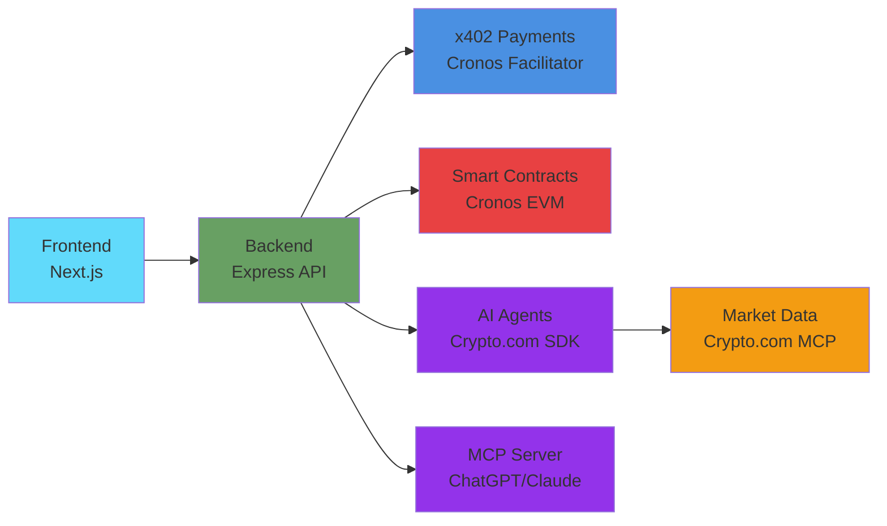

# VeriScore - Credit Scoring Infrastructure for Exchanges

<div align="center">


### **Decentralized Credit Scoring Infrastructure with AI Agents**

**🏆 Built for Cronos x402 Paytech Hackathon**

</div>

---

## 🌟 **Overview**

**VeriScore** is a B2B credit scoring infrastructure that leverages blockchain technology, the x402 payment protocol, and AI agents to provide secure, transparent, and verifiable credit assessments for exchanges, banks, and financial institutions.


### **Key Features**

🔐 **Privy Authentication** - Email-based login/registration  
💳 **x402 Payment Protocol** - Seamless micropayments via Cronos x402 Facilitator  
🏦 **B2B Infrastructure** - Purpose-built for financial institutions  
⚡ **Cronos EVM** - Fast, low-cost transactions on Cronos blockchain  
📊 **Prepaid Credit System** - Flexible pay-as-you-go model  
🔍 **Mock User Database** - 100 pre-generated users for testing  
🤖 **AI Agents Integration** - Automated score queries and monitoring via Crypto.com AI Agent SDK  
📈 **Market Data Integration** - Crypto.com Market Data MCP for enhanced scoring  
🔌 **MCP Server** - Model Context Protocol integration for AI assistants

---

## 🏗️ **Architecture**



---

## 📦 **Smart Contracts**

Deployed on **Cronos EVM Testnet** (Chain ID: 338):

- **IdentityRegistry** - `0x1997AC40627138BCc6Ee38C242A23852bac4250e`
  - [View on Cronos Explorer](https://explorer.cronos.org/testnet/address/0x1997AC40627138BCc6Ee38C242A23852bac4250e)
  - Manages user identities and verification levels

- **CreditScoringMini** - `0x9C432BfC67208AA5F894E87ACE65D605DC1EF3Cb`
  - [View on Cronos Explorer](https://explorer.cronos.org/testnet/address/0x9C432BfC67208AA5F894E87ACE65D605DC1EF3Cb)
  - Calculates and stores credit scores

- **VeriScoreSBT** - `0x9C2Cb7711f9B4cA8C7F0E310F315A46CE79771cD`
  - [View on Cronos Explorer](https://explorer.cronos.org/testnet/address/0x9C2Cb7711f9B4cA8C7F0E310F315A46CE79771cD)
  - Soulbound Token (ERC-721) for verifiable credit scores

**All contracts are deployed and verified on Cronos Testnet.**

---

## 🚀 **Quick Start**

### **Prerequisites**

- Node.js 18+
- Wallet (MetaMask, Core Wallet, etc.)
- Cronos Testnet configured (Chain ID: 338)
- Cronos x402 Facilitator credentials

### **Installation**

```bash
# Clone repository
git clone <repo-url>
cd veriscore

# Install frontend dependencies
cd frontend
npm install

# Install backend dependencies
cd ../backend
npm install

# Install contract dependencies
cd ../contracts
npm install
```

### **Configuration**

#### **Frontend** (`frontend/.env.local`)

```env
NEXT_PUBLIC_API_URL=http://localhost:3001
NEXT_PUBLIC_CHAIN_ID=338

# Smart Contract Addresses (update after deployment)
NEXT_PUBLIC_IDENTITY_REGISTRY=0x0000000000000000000000000000000000000000
NEXT_PUBLIC_CREDIT_SCORING=0x0000000000000000000000000000000000000000
NEXT_PUBLIC_VERISCORE_SBT=0x0000000000000000000000000000000000000000
NEXT_PUBLIC_PRIVY_APP_ID=your-privy-app-id

# Cronos x402 Facilitator
NEXT_PUBLIC_CRONOS_FACILITATOR_WALLET=0x0000000000000000000000000000000000000000
```

#### **Backend** (`backend/.env`)

```env
PORT=3001
JWT_SECRET=your-super-secure-jwt-secret-change-this

# x402 Payment Mode
X402_MODE=simulated  # Use 'production' for real payments

# Smart Contract Addresses
VERISCORE_SBT_ADDRESS=0x0000000000000000000000000000000000000000
IDENTITY_REGISTRY_ADDRESS=0x0000000000000000000000000000000000000000
CREDIT_SCORING_ADDRESS=0x0000000000000000000000000000000000000000

# Cronos x402 Facilitator
CRONOS_FACILITATOR_SECRET=your-facilitator-secret
CRONOS_FACILITATOR_WALLET=0x0000000000000000000000000000000000000000

# RPC URL for Cronos
RPC_URL=https://evm-t3.cronos.org

# Merchant Wallet (receives payments)
MERCHANT_WALLET_ADDRESS=0x0000000000000000000000000000000000000000

PRIVY_APP_SECRET=your-privy-app-secret
```

### **Running**

```bash
# Terminal 1: Backend
cd backend
npm start

# Terminal 2: Frontend
cd frontend
npm run dev
```

---

## 🧪 **User Flow**

### **1. Register/Login**
- Navigate to `/login`
- Sign in with Privy (email-based authentication)
- Account is automatically created if it doesn't exist

### **2. Purchase Credits**
- Go to Dashboard → Subscription
- Select credit amount (minimum: 10 credits = 0.2 USDC)
- Connect wallet to Cronos Testnet
- Confirm payment via x402 protocol
- Credits are added to your balance

**Pricing:**
- 💰 **0.02 USDC per credit**
- 📦 **Minimum: 10 credits (0.2 USDC)**

### **3. Query Users**
- Go to Dashboard → Users
- Search users by name, score, or verification level (free)
- Click "View" on any user to see full details (consumes 1 credit)
- View complete user information (Email, Score, Verification Level, Wallet)

### **4. View Usage**
- Go to Dashboard → Usage
- Review purchase history and credit consumption

---

## 🤖 **AI Agents & MCP Integration**

VeriScore includes comprehensive AI agent capabilities and MCP Server integration for automated score queries and monitoring.

### **🔌 MCP Server (Model Context Protocol)**

VeriScore exposes credit scoring data via **MCP Server**, allowing AI assistants (ChatGPT, Claude) to directly query credit scores, SBTs, and identity verification.

**Available MCP Tools:**
- `query_score(walletAddress)` - Query credit score for any wallet
- `get_user_sbt(walletAddress)` - Get VeriScore SBT token data
- `verify_identity(walletAddress)` - Verify identity and verification level

**Integration:**
- Compatible with **Claude Desktop** and **ChatGPT**
- Exposes VeriScore data to AI assistants via standard MCP protocol
- **First credit scoring infrastructure accessible via MCP**

### **Crypto.com AI Agent SDK Integration**

- `POST /api/ai-agents/query-score` - Query user score (requires x402 payment)
- `POST /api/ai-agents/monitor-wallet` - Start automated wallet monitoring
- `POST /api/ai-agents/execute-action` - Execute automated actions
- `GET /api/ai-agents/health` - Health check for agents

### **Crypto.com Market Data MCP Integration**

- Real-time token prices for enhanced scoring
- Historical price data
- Market trend analysis
- Score enhancement with market data

### **Example: Query Score via AI Agent**

```bash
curl -X POST http://localhost:3001/api/ai-agents/query-score \
  -H "Content-Type: application/json" \
  -H "X-Payment: <payment-proof>" \
  -d '{
    "walletAddress": "0x...",
    "agentId": "agent-123"
  }'
```

---

## 📡 **API Endpoints**

### **Authentication**
- `POST /api/auth/privy-login` - Sync Privy user with backend JWT
- `GET /api/auth/me` - Get authenticated user info

### **Subscriptions (x402 Protected)**
- `POST /api/subscriptions/purchase` - Purchase credits (x402)
- `GET /api/subscriptions/balance` - Get credit balance
- `GET /api/subscriptions/usage` - Get usage history

### **User Queries**
- `GET /api/mockUsers/search` - Search users (free, no credits)
- `GET /api/mockUsers/:id` - Get user details (consumes 1 credit)
- `GET /api/mockUsers/stats` - Database statistics

### **AI Agents**
- `POST /api/ai-agents/query-score` - Query score (x402 protected)
- `POST /api/ai-agents/monitor-wallet` - Monitor wallet (x402 protected)
- `POST /api/ai-agents/execute-action` - Execute action (x402 protected)
- `GET /api/ai-agents/health` - Health check

---

## 💡 **Technical Stack**

**Frontend:**
- Next.js 14 (App Router)
- Privy (Authentication)
- Wagmi + RainbowKit (Wallet connection)
- Cronos x402 Facilitator Client
- Tailwind CSS

**Backend:**
- Node.js + Express
- JWT Authentication
- Cronos x402 Payment Gateway
- Crypto.com AI Agent SDK (integration)
- Crypto.com Market Data MCP (integration)
- MCP Server for AI assistants
- JSON file storage (MVP)

**Blockchain:**
- Cronos EVM (Testnet/Mainnet)
- Solidity 0.8.20
- Hardhat

---

## 🎨 **Features**

### **💳 x402 Payment Integration (Real Testnet)**
- **HTTP 402 Payment Required** response
- **Cronos x402 Facilitator** integration (real, not simulated)
- **Automatic payment verification** on-chain
- **Real transactions** on Cronos Testnet
- **On-chain verification** of all payments
- View transactions: [Cronos Explorer](https://explorer.cronos.org/testnet)

**Payment Flow:**
1. User requests service → Backend responds with `402 Payment Required`
2. Frontend generates x402 payment proof
3. User approves transaction in wallet
4. Payment executed on Cronos Testnet
5. Backend verifies payment on-chain
6. Service granted

### **Credit System**
- Prepaid credit model
- Transparent pricing (0.02 USDC/credit)
- Automatic credit consumption
- Complete usage tracking

### **AI Agents**
- Automated score queries
- Wallet monitoring
- Action execution
- Integration with Crypto.com AI Agent SDK

### **Market Data Integration**
- Crypto.com Market Data MCP integration
- Real-time token prices
- Historical price data
- Score enhancement with market data

### **MCP Server** 🔌
- **Model Context Protocol (MCP)** integration
- Exposes VeriScore data to AI assistants (ChatGPT, Claude)
- **3 Tools Available:**
  - `query_score` - Query credit score for a wallet address
  - `get_user_sbt` - Get VeriScore SBT (Soulbound Token) for a wallet
  - `verify_identity` - Verify identity and verification level
- Compatible with Claude Desktop and ChatGPT
- **First implementation of credit scoring data via MCP**

**Example Usage:**
```javascript
// AI Assistant can now query VeriScore data
"Query the credit score for wallet 0x..."
"Get the SBT for this address..."
"Verify the identity level..."
```

---

## 📸 **Screenshots**

> **Note:** Screenshots will be added here. For now, you can see the live application at `http://localhost:3000` after running the frontend.

**Planned Screenshots:**
- 🏠 Home Page
- 🔐 Login/Registration with Privy
- 💳 Credit Purchase with x402 Payment
- 📊 User Dashboard
- 🔍 User Search and Details
- 📈 Usage History
- 🤖 MCP Server Integration
- ⛓️ On-chain Transactions (Cronoscan)

**To add screenshots:**
1. Take screenshots of key features
2. Save them in `/screenshots` folder
3. Update this section with image links

---

## 📊 **Project Status**

### **✅ Implemented**
- ✅ Privy email authentication
- ✅ **Cronos x402 payment protocol** (real testnet payments)
- ✅ **Prepaid credit system** with on-chain verification
- ✅ Mock user database (100 users)
- ✅ Free search + paid detail view
- ✅ Complete dashboard interface
- ✅ **3 Smart contracts deployed** on Cronos Testnet
- ✅ **AI Agent endpoints** (Crypto.com AI Agent SDK)
- ✅ **MCP Server** functional (3 tools exposed)
- ✅ **Market Data integration** (Crypto.com Market Data MCP)
- ✅ **On-chain payment verification**

### **⚠️ Future Enhancements**
- Real database migration (PostgreSQL/MongoDB)
- IPFS integration for documents
- Advanced credit scoring algorithms
- Full Crypto.com AI Agent SDK integration
- Complete MCP Server implementation
- Multi-chain support
- API rate limiting

---

## 🔧 **Deployment**

### **Deploy Contracts to Cronos**

```bash
cd contracts

# Deploy to Cronos Testnet
npm run deploy:cronos-testnet

# Deploy to Cronos Mainnet
npm run deploy:cronos-mainnet
```

After deployment, update the contract addresses in your `.env` files.

### **Get Testnet Tokens**

Visit [Cronos Faucet](https://cronos.org/faucet) to get testnet tokens.

---

## 📚 **Documentation**

- [Cronos x402 Facilitator SDK](https://github.com/cronos-labs/x402-examples)
- [Cronos EVM Docs](https://docs.cronos.org)
- [Crypto.com AI Agent SDK](https://ai-agent-sdk-docs.crypto.com/)
- [Crypto.com Market Data MCP](https://mcp.crypto.com/docs)
- [Cronos x402 Integration Guide](https://docs.cronos.org/cronos-x402-facilitator/introduction)

---

## 🏆 **Hackathon Submission - Multiple Tracks**

This project is built for the **Cronos x402 Paytech Hackathon** and applies to **4 tracks**:

### **Track 1: Main Track - x402 Applications (Broad Use Cases)** ✅
- AI agents using x402 for automated score queries
- Agent-triggered payments via x402 protocol
- AI-driven contract interactions
- Automated on-chain actions

### **Track 2: x402 Agentic Finance/Payment Track** ✅
- Automated settlement pipelines with x402
- Multi-step x402 automation for credit purchases
- Prepaid credit system with x402 payments
- Payment verification flows on-chain

### **Track 3: Crypto.com X Cronos Ecosystem Integrations** ✅
- **Crypto.com AI Agent SDK** integration for automated queries
- **Crypto.com Market Data MCP** integration for enhanced scoring
- Cronos EVM smart contracts deployed
- x402-powered settlement workflows

### **Track 4: Dev Tooling & Data Virtualization Track** ✅
- **MCP Server** for AI assistants (ChatGPT, Claude)
- Data virtualization layer for credit scores
- Agent-readable feeds via MCP
- Developer tooling for x402 agents

**Hackathon Requirements:**
- ✅ On-chain component (Cronos EVM) - **3 contracts deployed**
- ✅ x402-compatible payment flows - **Real payments on testnet**
- ✅ AI agent integration - **Crypto.com AI Agent SDK**
- ✅ Crypto.com ecosystem integration - **Market Data MCP + AI Agent SDK**
- ✅ Functional prototype - **Full-stack application**

---

## 📚 **TEAM**

- Arturo Marin Bosquet
- Diego Raúl Barrionuevo

---

<div align="center">

**Made with 🔥 for Cronos x402 Paytech Hackathon**

</div>
